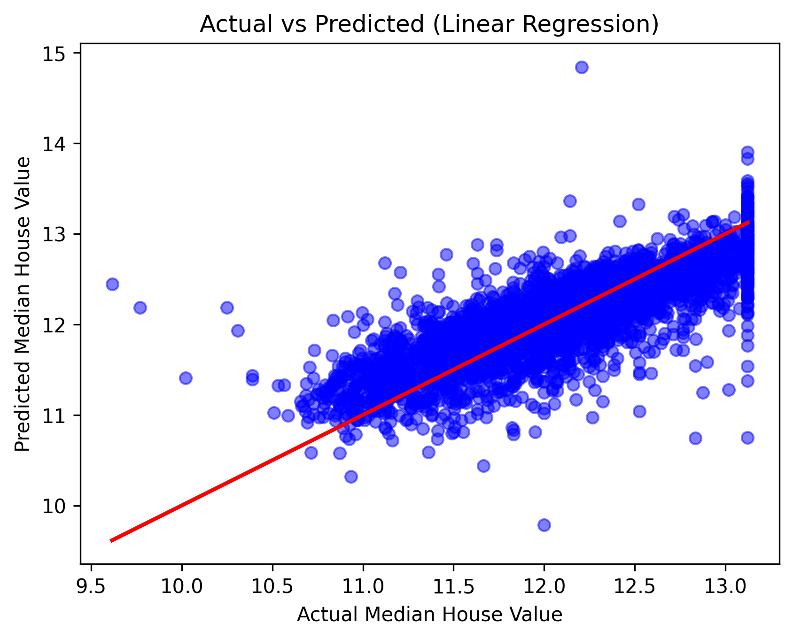

# Predicting House Prices with Multiple Linear Regression

This project builds a Multiple Linear Regression model to predict house prices from housing.csv, leveraging multiple features to provide insights for real estate valuation and decision-making.

## How It Works

**Dataset:** "housing.csv" with 20,640 entries and 10 columns (9 numerical, 1 categorical).

**Approach:** Conducted exploratory data analysis (correlations, distributions), preprocessed data (handled missing values, scaled features), and trained a Multiple Linear Regression model using a pipeline for streamlined processing and prediction.

**Tools:** Python, pandas, numpy, scikit-learn, matplotlib, seaborn.

## What I Achieved

**Results:** The model achieves an R² score of 0.639 (explaining 64% of variance), RMSE of 0.117, MAE of 0.251, and MAPE of 2.09%, indicating moderate predictive performance.

**Insights:** The model captures key trends in house price variation, but incorporating additional features or non-linear models could further improve accuracy.

**Visualization:**  Actual vs. Predicted House Prices

  

## Setup

1. Clone the repo: git clone https://github.com/ZainShah740/ML-Regression-HousePricePrediction-Project2.git 
2. Install dependencies: pip install -r requirements.txt  
3. Open House_Price_Prediction.ipynb in Jupyter to run and explore the model.

## 🤝Connect for Collaboration
Open to discussions on ML, tech innovations, or joint projects—let’s build impactful AI solutions!  

- <a href="https://www.linkedin.com/in/zain-shah-871aa532a">
     LinkedIn
  </a>

- <a href="https://x.com/zainshah_x">
     Twitter (X)
  </a>

- <a href="mailto:btenmeten12345@gmail.com">
     Gmail
  </a>

Star if useful, and check my profile for more projects!

